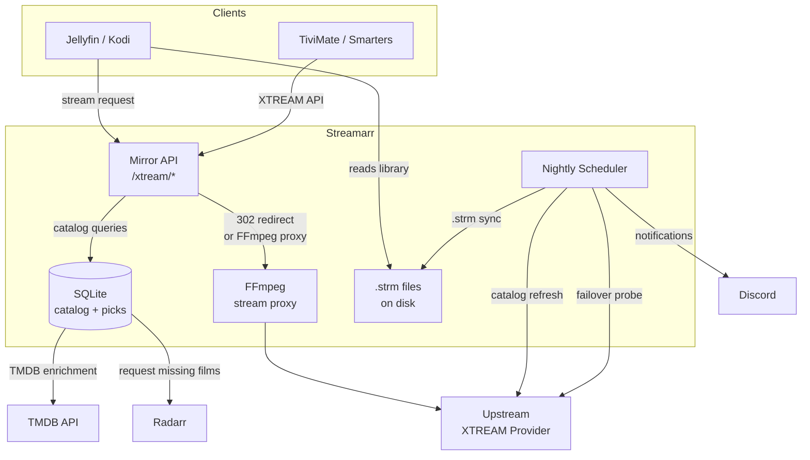

# Streamarr

**Self-hosted XTREAM Codes IPTV curator for Jellyfin and Kodi.**

Streamarr connects to an XTREAM Codes IPTV subscription, lets you hand-pick the series and movies you actually want, and generates a clean `.strm` file library that Jellyfin or Kodi treats as a regular local collection — with metadata, artwork, subtitles, and watched-state tracking.

> **Bring your own XTREAM subscription.** Streamarr is a management layer; it does not provide or bundle any content.

---

## Table of Contents

- [How it works](#how-it-works)
- [Features](#features)
- [Architecture](#architecture)
- [Quick Start](#quick-start)
- [Configuration reference](#configuration-reference)
- [Shows & Movies curation](#shows--movies-curation)
- [Provider URL management](#provider-url-management)
- [Nightly jobs](#nightly-jobs)
- [Stream proxy](#stream-proxy)
- [Jellyfin stuck-session watchdog](#jellyfin-stuck-session-watchdog)
- [Integrations](#integrations)

---

## How it works

### XTREAM Codes in 60 seconds

XTREAM Codes is the API protocol used by most IPTV providers. A subscription gives you a base URL, a username, and a password. From there you can query a catalog of thousands of series, movies, and live channels, and stream any of them via a direct URL.

The problem: providers expose their entire catalog — often 50 000+ entries across dozens of languages — and stream URLs embed real credentials. Pointing Jellyfin directly at an upstream XTREAM provider would expose your credentials in every `.strm` file and force Jellyfin to manage a 50k-entry library with no curation.

### What Streamarr does instead

```
Provider catalog (50 000+ entries)
         │
         ▼
   Streamarr DB ◄── you subscribe/curate from the web UI
   (your picks)
         │
         ├── .strm files ──► Jellyfin / Kodi library
         │    (one per episode / movie)
         │
         └── mirror API ──► TiviMate / Smarters / other XTREAM clients
              (credentials scrubbed, only your picks served)
```

1. **Streamarr pulls** the full catalog from your provider and stores it locally.
2. **You subscribe** to the series and movies you want from the web UI.
3. **Streamarr generates `.strm` files** — one per episode and movie — containing a URL that points back at Streamarr itself.
4. **Jellyfin scans** the `.strm` library just like any local folder: it fetches metadata from TMDB, downloads artwork, tracks progress.
5. **At playback**, Streamarr either redirects to the upstream stream URL (fast, no overhead) or proxies it through a local FFmpeg remux (clean timestamps, reliable subtitles).

Your real provider credentials never appear in `.strm` files or reach client devices.

---

## Features

**Curation**
- Browse the full provider catalog by category and language
- Subscribe to series; add movies to your library
- Language filter: surface only the languages you want (e.g. `fr,en`)
- TMDB enrichment: title, synopsis, cast, poster, backdrop, runtime
- Collection browser: view and complete film sagas (Marvel, Bond, …)
- Radarr integration: request missing saga films with one click

**Library generation**
- Generates Jellyfin/Kodi-compatible `.strm` files with `[tmdbid-N]` folder hints for reliable metadata matching
- Nightly sync: new episodes appear automatically, stale files are removed
- Episode deduplication: handles providers that serve the same episode twice (different qualities)

**Provider resilience**
- Multi-URL failover: maintain a ranked list of provider URLs; Streamarr auto-promotes on dead-URL detection
- In-band failover: triggered immediately on any API or stream error, not just nightly
- [EPGenius](https://epgenius.org) sync: push the new URL to your EPGenius-hosted playlist after every failover

**Stream quality**
- **Stream proxy** (`PROXY_STREAMS=true`): pipes every stream through a local FFmpeg remux, normalising MKV timestamps — fixes subtitle lag and eliminates Jellyfin ffprobe failures caused by multi-hop provider redirects
- **Jellyfin watchdog**: detects and auto-heals sessions stuck at position 0 (null MediaStreams cache), triggering a metadata refresh and killing the broken transcode

**Mirror endpoint**
- Full XTREAM Codes API mirror at `/xtream` — point TiviMate, Smarters, or any XTREAM client here
- Serves only your curated picks; real credentials are never exposed to clients
- Live TV stubbed as `[]` by design (Streamarr is a VOD/series tool)

**Notifications**
- Discord webhook: URL failovers, nightly summary, catalog errors, watchdog auto-heals

---

## Architecture



### Stream playback: two modes

```
Default (PROXY_STREAMS=false)
──────────────────────────────
Jellyfin ffprobe ──► Streamarr :8011 ──302──► cf.provider.com ──302──► 185.x.x.x
                                                                         raw MKV bytes ◄──

Proxy mode (PROXY_STREAMS=true)  ← recommended for Jellyfin
──────────────────────────────────────────────────────────────
Jellyfin ffprobe ──► Streamarr :8011
                          │
                          └──► ffmpeg -i <upstream_url> -c copy -avoid_negative_ts make_zero
                                         │
                                   timestamp-normalised MKV ──► Jellyfin ffprobe (localhost)
```

Proxy mode adds ~2–4 s of startup buffering (FFmpeg probing the upstream) in exchange for:
- Reliable ffprobe (no multi-hop redirect timeouts)
- Subtitle tracks in sync with video
- One upstream connection per stream instead of two (probe + transcode)

---

## Quick Start

### Prerequisites

- Docker + Docker Compose
- An XTREAM Codes IPTV subscription (base URL + username + password)
- A Jellyfin or Kodi library directory writable by Docker

### 1. Clone and configure

```bash
git clone https://github.com/ZeSlammy/Streamarr.git
cd Streamarr
cp .env.example .env
cp URL.md.example URL.md
```

Edit `.env` with your provider credentials and paths:

```env
XTREAM_URL=http://your-provider.com:8080
XTREAM_USERNAME=your_username
XTREAM_PASSWORD=your_password

LIBRARY_PATH=/home/youruser/xtream_strm       # host path for series .strm files
LIBRARY_PATH_MOVIES=/home/youruser/xtream_movies  # host path for movie .strm files

MIRROR_PUBLIC_URL=http://YOUR_SERVER_IP:8011  # reachable from your clients
```

Edit `URL.md` — put your provider base URL under `CURRENT:`:

```
CURRENT:
http://your-provider.com:8080
```

### 2. Start

```bash
docker compose up -d
```

Streamarr is now running at `http://localhost:8011`.

### 3. Point Jellyfin at the library folders

In Jellyfin → Dashboard → Libraries, add:
- **XTream Shows** (type: Shows) → path: your `LIBRARY_PATH`
- **XTream Movies** (type: Movies) → path: your `LIBRARY_PATH_MOVIES`

Enable **Open Subtitles** plugin on the libraries if you want automatic subtitle downloads.

### 4. Curate your library

Open `http://YOUR_SERVER_IP:8011` → **Browse** to explore the catalog → click **Subscribe** on series you want or **Add to library** on movies.

Run a manual sync to generate the `.strm` files immediately:

```bash
curl -X POST http://localhost:8011/sync/run
```

Jellyfin will pick up the new files on its next scan.

---

## Configuration reference

All settings are environment variables (set in `.env` or `docker-compose.yml`).

### Core — required

| Variable | Description |
|---|---|
| `XTREAM_URL` | Provider base URL (fallback; `URL.md` takes precedence when present) |
| `XTREAM_USERNAME` | Provider username |
| `XTREAM_PASSWORD` | Provider password |
| `LIBRARY_PATH` | **Host** path where series `.strm` files are written |
| `LIBRARY_PATH_MOVIES` | **Host** path where movie `.strm` files are written |
| `MIRROR_PUBLIC_URL` | Public URL clients use to reach Streamarr (embedded in `.strm` files) |

### Mirror credentials

| Variable | Default | Description |
|---|---|---|
| `MIRROR_USERNAME` | `mirror` | Username clients send to the mirror API (any value accepted) |
| `MIRROR_PASSWORD` | `mirror` | Password clients send to the mirror API (any value accepted) |

### Language filter

| Variable | Default | Description |
|---|---|---|
| `ALLOWED_LANGUAGES` | `fr,en` | Comma-separated ISO 639-1 codes shown in the browse UI |
| `ALLOW_LANGUAGE_UNKNOWN` | `false` | Show entries with no detectable language prefix |
| `ALLOW_LANGUAGE_SUBS_ONLY` | `false` | Show entries tagged as subtitle-only (VOSTFR, MULTI-SUBS) |
| `LANGUAGE_FILTER_ENABLED` | `true` | Master switch — `false` shows the full unfiltered catalog |

### Nightly scheduler

| Variable | Default | Description |
|---|---|---|
| `SYNC_CRON_HOUR` | `3` | Hour to run the nightly job (24h) |
| `SYNC_CRON_MINUTE` | `0` | Minute to run the nightly job |
| `SYNC_CRON_TIMEZONE` | `Europe/Paris` | Timezone for the cron schedule |
| `SYNC_CRON_ENABLED` | `true` | Set `false` to disable automatic nightly runs |
| `STRM_AUDIT_SAMPLE` | `10` | Number of shows to spot-check during the nightly `.strm` audit |

### TMDB & Radarr

| Variable | Description |
|---|---|
| `TMDB_API_KEY` | TMDB v3 API key — enables movie enrichment, collections browser. Get one free at [themoviedb.org](https://www.themoviedb.org/settings/api) |
| `RADARR_URL` | Radarr base URL — enables "Request" button on missing collection films |
| `RADARR_API_KEY` | Radarr API key |
| `RADARR_ROOT_FOLDER` | Root folder Radarr should use for requested films |
| `RADARR_QUALITY_PROFILE_ID` | Radarr quality profile ID (default: `1`) |

### Stream proxy

| Variable | Default | Description |
|---|---|---|
| `PROXY_STREAMS` | `false` | Route streams through local FFmpeg remux instead of 302 redirect. Fixes subtitle lag and prevents stuck Jellyfin sessions. Recommended for Jellyfin setups. |

### Jellyfin watchdog

| Variable | Default | Description |
|---|---|---|
| `JELLYFIN_URL` | `http://localhost:8096` | Jellyfin base URL |
| `JELLYFIN_API_KEY` | — | API key for the watchdog. Generate at: Dashboard → API Keys → +. **Required** to activate the watchdog. |
| `JELLYFIN_WATCHDOG_ENABLED` | `true` | Enable/disable the watchdog job |
| `JELLYFIN_WATCHDOG_INTERVAL_MINUTES` | `2` | How often to sweep for stuck sessions |
| `JELLYFIN_STUCK_THRESHOLD_SECONDS` | `45` | Kill a session if stuck at position 0 for longer than this |

### Discord

| Variable | Description |
|---|---|
| `DISCORD_WEBHOOK_URL` | Webhook URL for notifications. Leave empty to disable. |

### EPGenius

| Variable | Default | Description |
|---|---|---|
| `EPGENIUS_ENABLED` | `true` | Push new provider URL to EPGenius after failover |
| `EPGENIUS_API_KEY` | — | API key from the EPGenius Discord bot |
| `EPGENIUS_DISCORD_ID` | — | Your Discord user ID |
| `EPGENIUS_PLAYLIST_ID` | — | Playlist Key from the EPGenius `/info` bot command |
| `EPGENIUS_M3U_URL` | — | Google Drive download URL for your EPGenius M3U (used for nightly verification) |

---

## Shows & Movies curation

### Series

Navigate to **Browse → Series**. The catalog is grouped by category and filtered by your `ALLOWED_LANGUAGES`. Search by name or filter by category.

Click **Subscribe** on a show. Streamarr will:
1. Fetch the episode list from the provider
2. Create a folder structure: `Show Name (Year) [tmdbid-N]/Season 01/Show Name S01E01.strm`
3. The `[tmdbid-N]` hint tells Jellyfin exactly which TMDB entry to use, bypassing fuzzy name matching

### Movies

Navigate to **Browse → Movies**. Same language filter applies.

Click **Add to library**. Streamarr creates: `Movie Name (Year) [tmdbid-N]/Movie Name.strm`

The **Collections** view groups saga films (e.g. the Marvel Cinematic Universe) and shows which entries you have and which are missing. Missing entries can be sent to Radarr with one click.

### Nightly `.strm` sync

Every night, Streamarr:
- Fetches the latest episode list for every subscribed series
- Writes `.strm` files for new episodes
- Removes `.strm` files for episodes that disappeared from the provider
- Audits a random sample of `.strm` files to verify they point at the current active provider URL (detects stale URLs after a failover)

---

## Provider URL management

`URL.md` (bind-mounted into the container) controls which provider URLs Streamarr uses:

```
CURRENT:
http://active-provider.com:8080

CANDIDATES:
http://backup-provider.com:8080

BURNED:
http://dead-provider.com  # burned 2026-01-01T00:00:00Z (HTTP 403)
```

- **CURRENT** — the active URL. Only one entry.
- **CANDIDATES** — tested in order when the current URL fails.
- **BURNED** — permanently excluded from rotation (with a reason comment).

Streamarr rewrites `URL.md` automatically when it promotes a candidate. You can also trigger a manual check:

```bash
curl -X POST http://localhost:8011/providers/check
```

Failover is also triggered **in-band**: if any API request to the provider returns a network error, HTTP 401/403/5xx, or HTML where JSON was expected, Streamarr probes all candidates immediately and promotes the best one before retrying the original request.

---

## Nightly jobs

The nightly scheduler runs at `SYNC_CRON_HOUR:SYNC_CRON_MINUTE` (default 03:00) in the configured timezone. Jobs run in sequence:

| Step | What it does |
|---|---|
| Failover check | Probes the current URL; promotes a candidate if dead |
| Catalog refresh | Pulls the latest series + categories from the provider |
| `.strm` audit | Spot-checks N random shows for stale URLs |
| Series sync | Writes/removes `.strm` files for all subscribed shows |
| VOD catalog refresh | Upserts the full movie catalog into the DB |
| Movie `.strm` sync | Writes/removes `.strm` files for all in-library movies |
| TMDB enrichment | Enriches up to 200 movies per night (fills in over multiple nights) |
| EPGenius verify | Checks that your EPGenius playlist URL matches the active provider |
| Discord summary | Posts a nightly summary with URL status, sync counts, and any warnings |

Trigger a full run manually:

```bash
curl -X POST http://localhost:8011/sync/run
```

### Discord nightly summary example

```
✅ URL alive: `http://cf.provider.com`
🔍 .strm audit: 9/10 fresh, 1 stale, 0 missing
✅ Sync: 87 shows, +4 / −0 files (status: done)
🎬 Movies: catalog 172000 (8 new, 12 upd) · +1 / −0 files
🛰️ EPGenius M3U: `http://cf.provider.com` matches active URL.
🔗 Mirror URL: `http://192.168.1.26:8011/xtream` (unchanged)
```

---

## Stream proxy

By default, Streamarr returns a **302 redirect** for stream requests — the client's media player opens the upstream stream directly. This is zero-overhead but has two failure modes in Jellyfin:

1. **Subtitle lag** — IPTV MKV streams often have non-zero start timestamps. Jellyfin's FFmpeg normalises the video track to start at 0, but embedded subtitle PTS values remain absolute, putting them out of sync with the picture.

2. **Stuck HLS sessions** — Jellyfin's ffprobe must follow a multi-hop redirect chain (Streamarr → CDN → origin server) under a tight timeout. When this fails, Jellyfin caches null MediaStreams for the item and enters a broken transcode loop that only clears on container restart.

Setting `PROXY_STREAMS=true` replaces the 302 with a local FFmpeg remux:

```bash
ffmpeg -probesize 1M -analyzeduration 1000000 \
       -i <upstream_url> \
       -c copy -avoid_negative_ts make_zero -map 0 \
       -f matroska pipe:1
```

- `-c copy` — no re-encode; CPU usage is minimal (~5% of one core per stream)
- `-avoid_negative_ts make_zero` — shifts all tracks (video, audio, subtitles) to a common zero origin
- Startup buffering: ~2–4 seconds while FFmpeg probes the upstream

Add to `.env`:

```env
PROXY_STREAMS=true
```

Then rebuild:

```bash
docker compose up -d --build
```

---

## Jellyfin stuck-session watchdog

When `PROXY_STREAMS=false` (or when a probe fails for any other reason), Jellyfin can enter a state where a transcode session is alive but stuck at position 0. The session accumulates failed ffprobe calls and only clears when the Jellyfin container is restarted.

The watchdog polls Jellyfin's Sessions API every `JELLYFIN_WATCHDOG_INTERVAL_MINUTES` and looks for sessions that are:
- Playing a `.strm` file (XTREAM content)
- Actively transcoding (not direct-play)
- Stuck at position 0 for longer than `JELLYFIN_STUCK_THRESHOLD_SECONDS`

When found, it:
1. Deletes the active encoding via the Jellyfin API
2. Triggers a `FullRefresh` on the item to clear the cached null MediaStreams from the database
3. Posts a Discord notification

To enable, generate an API key in Jellyfin (Dashboard → API Keys → +) and add to `.env`:

```env
JELLYFIN_API_KEY=your_api_key_here
```

The watchdog is dormant when `JELLYFIN_API_KEY` is empty — no polling occurs.

---

## Integrations

### Trakt

Streamarr can import your Trakt watchlist and automatically subscribe to matching series. Create an OAuth app at [trakt.tv/oauth/applications](https://trakt.tv/oauth/applications) and set:

```env
TRAKT_CLIENT_ID=...
TRAKT_CLIENT_SECRET=...
TRAKT_REDIRECT_URI=http://YOUR_SERVER_IP:8011/trakt/callback
```

Then connect at `http://YOUR_SERVER_IP:8011/trakt`.

### Open Subtitles

Streamarr saves `.strm` files and Jellyfin handles subtitle downloads natively via the Open Subtitles plugin. No Streamarr configuration needed — install the plugin in Jellyfin and enable it on your XTREAM libraries.

### EPGenius

[EPGenius](https://epgenius.org) hosts a managed M3U + EPG for your IPTV subscription. When your provider URL changes (failover), Streamarr automatically POSTs the new credentials to EPGenius so your TiviMate/Smarters playlist stays working without manual intervention. Configure via `EPGENIUS_*` env vars.

---

## Stack

| Layer | Technology |
|---|---|
| Backend | FastAPI + Python 3.12 |
| UI | Jinja2 + htmx + Bootstrap 5 |
| Database | SQLite via SQLModel |
| Container | Docker + Docker Compose |
| Scheduler | APScheduler (in-process) |
| Stream proxy | FFmpeg 7.x |

---

## Contributing

Pull requests welcome. Please open an issue first for significant changes.

The app has no hot-reload — every Python change requires a rebuild:

```bash
docker compose up -d --build
docker logs streamarr -f
```

---

## License

MIT
